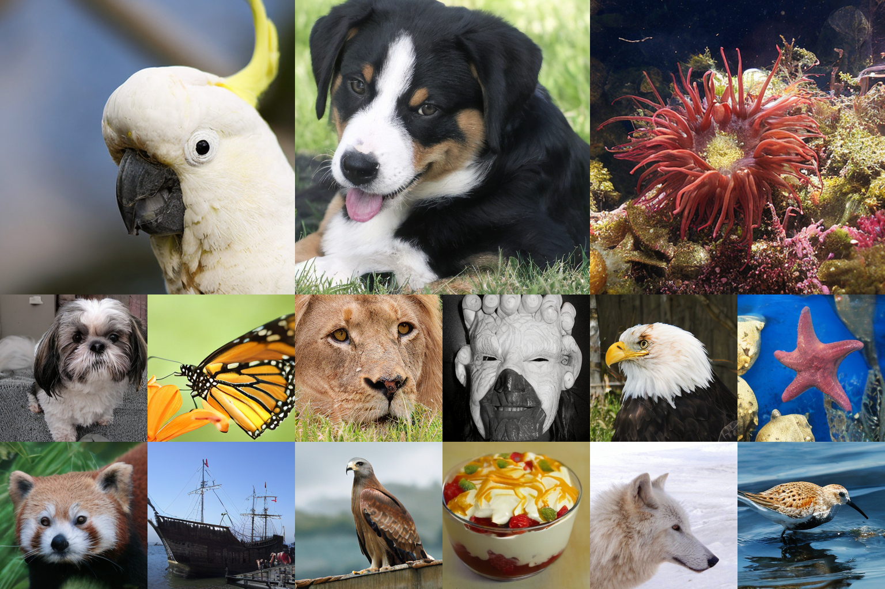
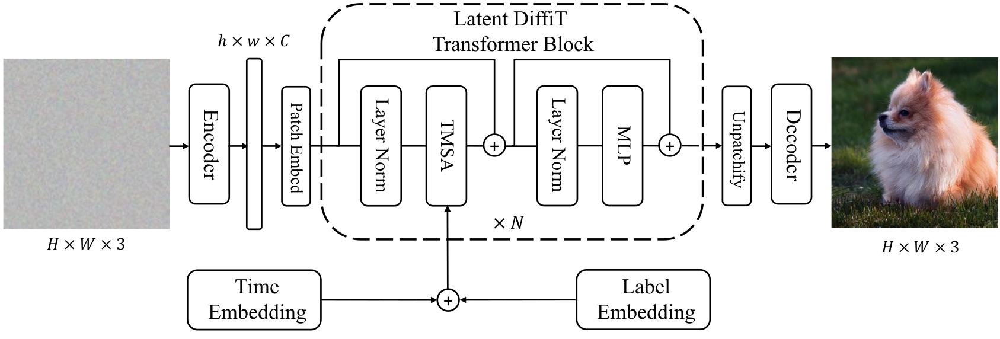

# DiffiT: Diffusion Vision Transformers for Image Generation

Official PyTorch implementation of [**DiffiT: Diffusion Vision Transformers for Image Generation**](https://arxiv.org/abs/2312.02139).

For business inquiries, please visit our website and submit the form: [NVIDIA Research Licensing](https://www.nvidia.com/en-us/research/inquiries/)

[](https://github.com/NVlabs/DiffiT/stargazers)

**DiffiT** (Diffusion Vision Transformers) is a generative model that combines the expressive power of diffusion models with Vision Transformers (ViTs), introducing **Time-dependent Multihead Self Attention (TMSA)** for fine-grained control over the denoising at each timestep. DiffiT achieves SOTA performance on class-conditional ImageNet generation at multiple resolutions, notably an **FID score of 1.73** on ImageNet-256.





## News
- **[03.08.2026]** DiffiT code and pretrained model are released!
- **[07.01.2024]** DiffiT has been accepted to [ECCV 2024](https://eccv.ecva.net/)!
- **[04.02.2024]** Updated [manuscript](https://arxiv.org/abs/2312.02139) now available on arXiv!
- **[12.04.2023]** Paper is published on arXiv!

## Models

### ImageNet-256

| Model | Dataset | Resolution | FID-50K | Inception Score | Download |
|-------|---------|-----------|---------|-----------------|----------|
| **DiffiT** | ImageNet | 256x256 | **1.73** | **276.49** | [model](https://huggingface.co/nvidia/DiffiT/resolve/main/diffit_256.safetensors) |

### ImageNet-512

| Model | Dataset | Resolution | FID-50K | Inception Score | Download |
|-------|---------|-----------|---------|-----------------|----------|
| **DiffiT** | ImageNet | 512x512 | **2.67** | **252.12** | [model](https://huggingface.co/nvidia/DiffiT/resolve/main/diffit_512.safetensors) |

## Installation

```bash
conda create -n diffit python=3.11 -y
conda activate diffit
pip install -r requirements.txt
```


## Pre-download Models (Offline Nodes)

The training script downloads two external models on first run. If your compute nodes have no internet access, run this **on a login node** first:

```bash
python download_models.py
```

This caches the following models locally:
- **stabilityai/sd-vae-ft-ema** (335 MB) — VAE for latent diffusion (`~/.cache/huggingface/`)
- **stabilityai/sd-vae-ft-mse** (335 MB) — VAE variant for `gen_images.py --vae-decoder mse`
- **InceptionV3** (104 MB) — for IS/FID metrics during training (`~/.cache/torch/hub/`)

> If your compute nodes use a shared filesystem with the login node, the cached files will be available automatically. Otherwise, ensure `~/.cache/huggingface/` and `~/.cache/torch/hub/` are synced.


## Data Preparation

Use `dataset_tool_for_imagenet.py` to convert an ImageNet-style directory into a ZIP archive with resized images and a `dataset.json` containing class labels.

```
python dataset_tool_for_imagenet.py \
    --source /path/to/ILSVRC \
    --dest ./datasets/imagenet_256x256.zip \
    --resolution 256x256 \
    --transform center-crop

python dataset_tool_for_imagenet.py \
    --source /path/to/ILSVRC \
    --dest ./datasets/imagenet_512x512.zip \
    --resolution 512x512 \
    --transform center-crop

python dataset_tool_for_imagenet.py \
    --source /path/to/ILSVRC \
    --dest ./datasets/imagenet_1024x1024.zip \
    --resolution 1024x1024 \
    --transform center-crop
```

For custom datasets, point `--source` at a directory with the ImageNet folder structure (`train/<class_id>/image.JPEG`). The tool will create a ZIP with resized images and a JSON with class labels.


## Training

### Base configurations

The `--cfg` flag selects a base configuration that sets model architecture,
resolution, learning rate, diffusion settings, etc. Individual CLI options
can still override any preset value.

| Config | Resolution | Model | LR | FP16 | kimg | Schedule Sampler |
|--------|-----------|-------|------|------|------|------------------|
| `diffit-256` | 256 | Diffit (XL/2) | 1e-4 | off | 400000 | uniform |
| `diffit-512` | 512 | Diffit (XL/2) | 1e-4 | on | 400000 | uniform |
| `diffit-1024` | 1024 | Diffit (XL/2) | 1e-4 | on | 400000 | uniform |

### Single command

Train DiffiT on ImageNet-256 with multi-GPU DDP:

```bash
python train.py --outdir=./training-runs \
    --cfg=diffit-256 \
    --data=./datasets/imagenet_256x256.zip \
    --gpus 4 \
    --batch-gpu 64
```

Train on ImageNet-512:

```bash
python train.py --outdir=./training-runs \
    --cfg=diffit-512 \
    --data=./datasets/imagenet_512x512.zip \
    --gpus 4 \
    --batch-gpu 25
```

### SLURM sbatch scripts

Pre-configured sbatch files are provided for A100 and H200 clusters:

**A100 (2 GPU):**
```bash
sbatch sbatch/a100/train_2_gpu_256x256.sbatch
sbatch sbatch/a100/train_2_gpu_512x512.sbatch
```

**H200 (4 GPU):**
```bash
sbatch sbatch/h200/h200_train_4_gpu_256x256.sbatch
sbatch sbatch/h200/h200_train_4_gpu_512x512.sbatch
```

**H200 (1 GPU):**
```bash
sbatch sbatch/h200/h200_train_1_gpu_256x256.sbatch
```

### Resume from checkpoint

```bash
python train.py --outdir=./training-runs \
    --cfg=diffit-256 \
    --data=./datasets/imagenet_256x256.zip \
    --gpus 4 \
    --batch-gpu 64 \
    --resume ./training-runs/00000-diffit-256-gpus4-batch256/network-snapshot-001000.pt
```

### Training options

| Option | Default | Description |
|--------|---------|-------------|
| `--outdir` | required | Output directory for training runs |
| `--cfg` | required | Base configuration (`diffit-256`, `diffit-512`) |
| `--data` | required | Path to dataset directory or .zip |
| `--gpus` | required | Number of GPUs |
| `--batch-gpu` | required | Batch size per GPU (total batch = batch-gpu * gpus) |
| `--image-size` | from cfg | Image resolution override |
| `--model` | from cfg | Model constructor name override |
| `--kimg` | from cfg | Total training duration in kimg |
| `--tick` | from cfg | Progress print interval (kimg) |
| `--snap` | from cfg | Snapshot save interval (ticks) |
| `--seed` | 0 | Random seed |
| `--lr` | from cfg | Learning rate override |
| `--fp32` | from cfg | Disable mixed precision |
| `--ema-rate` | from cfg | EMA decay rate override |
| `--resume` | None | Path to checkpoint for resuming |
| `--schedule-sampler` | from cfg | Timestep sampler override |
| `--num-fid-samples` | 2048 | Samples for FID/IS eval during training (0=disable) |
| `--workers` | 4 | DataLoader worker processes |

### Training output

Each run creates a directory with the following structure:

```
training-runs/00000-diffit-256-gpus4-batch256/
├── training_options.json         # All training hyperparameters
├── log.txt                       # Human-readable training log
├── progress.csv                  # CSV training metrics
├── progress.json                 # JSON training metrics
├── stats.jsonl                   # JSON Lines stats (SAN-v2 style)
├── events.out.tfevents.*         # TensorBoard event files
├── reals.png                     # Real training image grid
├── fakes_init.png                # Initial generated images (before training)
├── fakes000200.png               # Generated images at 200 kimg
├── fakes000400.png               # Generated images at 400 kimg
├── ...
├── network-snapshot-001000.pt    # Periodic checkpoint
├── network-snapshot-002000.pt
├── ...
└── network-final.pt              # Final trained model
```

Quality metrics (**IS**, **FID**, **sFID**, **Precision**, **Recall**) are computed automatically every `snap` ticks during training using 2048 samples by default. Results are logged to TensorBoard under `Metrics/` and to `stats.jsonl`. Adjust with `--num-fid-samples` (set to 0 to disable).

Monitor training with TensorBoard:

```bash
tensorboard --logdir ./training-runs
```


## Generating Samples

### Individual image generation

Generate individual PNG images for visual inspection:

```bash
python gen_images.py \
    --model-path ./training-runs/00000-diffit-256-gpus4-batch256/network-final.pt \
    --seeds 0-49 \
    --outdir ./generated/256 \
    --image-size 256 \
    --cfg-scale 4.4 \
    --num-sampling-steps 250
```

Options:
- `--seeds`: Comma-separated list or ranges (e.g., `0,1,4-6`)
- `--class-idx`: Specific class label (random if not specified)
- `--batch-sz`: Batch size per seed
- `--use-ddim`: Use DDIM sampling instead of DDPM
- `--cfg-scale`: Classifier-free guidance scale (4.4 for 256, 1.49 for 512)
- `--scale-pow`: Power for cosine CFG schedule

SLURM:
```bash
sbatch sbatch/a100/generate_1_gpu_256x256.sbatch
sbatch sbatch/a100/generate_1_gpu_512x512.sbatch
sbatch sbatch/h200/generate_4_gpu_256x256.sbatch
sbatch sbatch/h200/generate_4_gpu_512x512.sbatch
```

### Bulk sampling for FID evaluation

Generate 50K samples as `.npz` for FID evaluation:

**ImageNet-256:**
```bash
torchrun --nproc_per_node=4 sample.py \
    --model-path ./training-runs/00000-diffit-256-gpus4-batch256/network-final.pt \
    --outdir ./samples/256 \
    --image-size 256 \
    --cfg-scale 4.4 \
    --num-samples 50000 \
    --batch-size 16 \
    --num-sampling-steps 250 \
    --cfg-cond
```

**ImageNet-512:**
```bash
torchrun --nproc_per_node=4 sample.py \
    --model-path ./training-runs/00000-diffit-512-gpus4-batch100/network-final.pt \
    --outdir ./samples/512 \
    --image-size 512 \
    --cfg-scale 1.49 \
    --num-samples 50000 \
    --batch-size 8 \
    --num-sampling-steps 250 \
    --cfg-cond
```

SLURM:
```bash
sbatch sbatch/a100/sample_4_gpu_256x256.sbatch
sbatch sbatch/a100/sample_4_gpu_512x512.sbatch
sbatch sbatch/h200/sample_4_gpu_256x256.sbatch
sbatch sbatch/h200/sample_4_gpu_512x512.sbatch
```


## Quality Metrics

Quality metrics are computed **inline during training** every `snap` ticks. The following metrics are evaluated and logged to TensorBoard (`Metrics/`) and `stats.jsonl`:

- **Inception Score (IS)** — diversity and quality of generated classes
- **FID** — Frechet Inception Distance (pool features)
- **sFID** — spatial FID (captures spatial structure)
- **Precision** — fraction of generated samples in the real data manifold
- **Recall** — fraction of real samples covered by the generated manifold

By default, 2048 samples are generated for each evaluation (configurable via `--num-fid-samples`). For a full FID-50K evaluation, use the standalone evaluator:

```bash
python evaluator.py \
    --ref-batch ./VIRTUAL_imagenet256_labeled.npz \
    --sample-batch ./samples/256/samples_50000x256x256x3.npz
```

### Expected Results

**ImageNet-256:**

| Inception Score | FID | sFID | Precision | Recall |
|:-:|:-:|:-:|:-:|:-:|
| 276.49 | 1.73 | 4.54 | 0.8024 | 0.6205 |

**ImageNet-512:**

| Inception Score | FID | sFID | Precision | Recall |
|:-:|:-:|:-:|:-:|:-:|
| 252.13 | 2.67 | 4.99 | 0.8277 | 0.5500 |

> **Note:** Small variations in the reported numbers are expected depending on the device used for sampling and due to numerical precision differences.


## Project Structure

```
DiffiT-v2/
├── diffit/                          # Core model architecture
│   ├── __init__.py                 # Diffusion creation & defaults
│   ├── diffit.py                   # DiffiT model (ViT + TMSA)
│   ├── gaussian_diffusion.py       # Diffusion process (DDPM/DDIM)
│   ├── respace.py                  # Timestep respacing
│   ├── dist_util.py                # Distributed training (PyTorch DDP)
│   ├── image_datasets.py           # Dataset loading (dir/zip + DistributedSampler)
│   ├── logger.py                   # Logging (stdout, JSON, CSV, TensorBoard)
│   ├── fp16_util.py                # Mixed precision training
│   ├── nn.py                       # Neural network utilities
│   ├── timestep_sampler.py         # Timestep sampling strategies
│   ├── diffusion_utils.py          # KL divergence & likelihood
│   └── pos_emb.py                  # Positional embeddings (CoordConv, Swin)
├── train.py                         # Training script (DDP, click CLI)
├── sample.py                        # Bulk sampling for FID (.npz output)
├── gen_images.py                    # Individual PNG generation (click CLI)
├── evaluator.py                     # FID/IS evaluation (PyTorch)
├── dataset_tool_for_imagenet.py     # ImageNet -> ZIP dataset converter
├── download_models.py               # Pre-download VAE + InceptionV3 for offline nodes
├── eval_run.sh                      # Evaluation convenience script
├── sbatch/                          # SLURM job scripts
│   ├── a100/                       # A100 cluster (2 GPU)
│   │   ├── train_2_gpu_256x256.sbatch
│   │   ├── train_2_gpu_512x512.sbatch
│   │   ├── generate_1_gpu_256x256.sbatch
│   │   ├── generate_1_gpu_512x512.sbatch
│   │   ├── sample_4_gpu_256x256.sbatch
│   │   └── sample_4_gpu_512x512.sbatch
│   └── h200/                       # H200 cluster (4 GPU)
│       ├── h200_train_4_gpu_256x256.sbatch
│       ├── h200_train_4_gpu_512x512.sbatch
│       ├── h200_train_1_gpu_256x256.sbatch
│       ├── generate_4_gpu_256x256.sbatch
│       ├── generate_4_gpu_512x512.sbatch
│       ├── sample_4_gpu_256x256.sbatch
│       └── sample_4_gpu_512x512.sbatch
├── requirements.txt                 # Python dependencies
└── README.md
```

## Citation

```
@inproceedings{hatamizadeh2025diffit,
  title={Diffit: Diffusion vision transformers for image generation},
  author={Hatamizadeh, Ali and Song, Jiaming and Liu, Guilin and Kautz, Jan and Vahdat, Arash},
  booktitle={European Conference on Computer Vision},
  pages={37--55},
  year={2025},
  organization={Springer}
}
```

## Licenses

Copyright 2026, NVIDIA Corporation. All rights reserved.

This work is made available under the NVIDIA Source Code License-NC. Click [here](LICENSE) to view a copy of this license.

The pre-trained models are shared under [CC-BY-NC-SA-4.0](https://creativecommons.org/licenses/by-nc-sa/4.0/). If you remix, transform, or build upon the material, you must distribute your contributions under the same license as the original.

## Acknowledgement
We gratefully acknowledge the authors of [Guided-Diffusion](https://github.com/openai/guided-diffusion/tree/main/), [DiT](https://github.com/facebookresearch/DiT/tree/main) and [MDT](https://github.com/sail-sg/MDT/tree/mdtv1) for making their excellent codebases publicly available.
