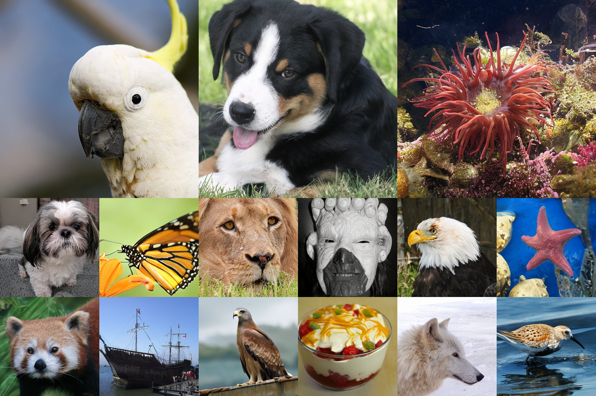
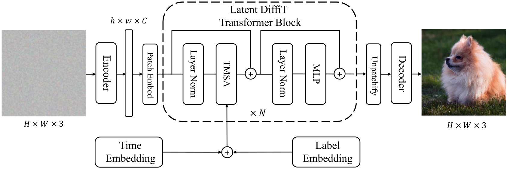

# DiffiT: Diffusion Vision Transformers for Image Generation

Official PyTorch implementation of [**DiffiT: Diffusion Vision Transformers for Image Generation**](https://arxiv.org/abs/2312.02139).

For business inquiries, please visit our website and submit the form: [NVIDIA Research Licensing](https://www.nvidia.com/en-us/research/inquiries/)

[](https://github.com/NVlabs/DiffiT/stargazers)

**DiffiT** (Diffusion Vision Transformers) is a generative model that combines the expressive power of diffusion models with Vision Transformers (ViTs), introducing **Time-dependent Multihead Self Attention (TMSA)** for fine-grained control over the denoising at each timestep. DiffiT achieves SOTA performance on class-conditional ImageNet generation at multiple resolutions, notably an **FID score of 1.73** on ImageNet-256.

**DiffiT-v2** is a performance refresh of this codebase. TMSA is preserved exactly as defined in the paper (Section 3.2, Eqs 3–5). What changes is the attention plumbing around it — the learned relative-position bias is replaced with **RoPE-2D** so SDPA can dispatch to FlashAttention, **QK-norm** is added for bf16 stability, LayerNorm becomes RMSNorm, and the MLP switches to SwiGLU. Training and sampling are rebuilt around **self-spawning `torch.multiprocessing`**, `torch.compile`, and a **`click` CLI**. The repo follows the shared **v2 convention** used across the WC-Co model repos (san-v2 / StyleSwin-v2 / EDM2-v2): a single EMA-only snapshot artifact, uniform training/generation flags, a self-describing dataset/label contract, and combra generative-quality metrics — see the [3.0.0 changelog](./CHANGELOG.md) and [Differences from the original NVlabs/DiffiT](#differences-from-the-original-nvlabsdiffit) below.





## News
- **[07.17.2026]** DiffiT-v2 3.0.0 — adopts the shared **v2 convention**: EMA-only `diffit-snapshot-<kimg>-inference.pt` checkpoints (no resume/best/final), `--precision` / `True/False` flags / `--init-weights`, self-spawning `--gpus` generation with per-image seeds and unified HDF5, a `class_names` dataset/label contract, and scalar-only `stats.jsonl`. Breaking — see the [changelog](./CHANGELOG.md).
- **[04.19.2026]** DiffiT-v2 performance refresh: RoPE-2D + FlashAttention, QK-norm, RMSNorm, SwiGLU. 1024² now a first-class config.
- **[03.08.2026]** DiffiT code and pretrained model are released!
- **[07.01.2024]** DiffiT has been accepted to [ECCV 2024](https://eccv.ecva.net/)!
- **[04.02.2024]** Updated [manuscript](https://arxiv.org/abs/2312.02139) now available on arXiv!
- **[12.04.2023]** Paper is published on arXiv!

## Differences from the original NVlabs/DiffiT

Audited against the upstream [NVlabs/DiffiT](https://github.com/NVlabs/DiffiT) code
(this repo's first commit) and the paper (arXiv 2312.02139) on 2026-09-25. Upstream
ships the model, the diffusion code and a sampling script only; the training recipe
comes from the paper. **Kind:** *improvement* = deliberate model/training change;
*contract* = the shared v2 convention of the four WC-Co model repos (san-v2 /
StyleSwin-v2 / EDM2-v2 / DiffiT-v2); *adaptation* = fitted to this project's data,
hardware or evaluation.

**Model:**

| Area | Upstream / paper | This fork | Kind |
|---|---|---|---|
| Position encoding | Fixed 2-D sin-cos `pos_embed` added to the patch tokens, plus a learned Swin-style relative-position bias table per block, indexed by an `int64` `relative_position_index` buffer (one per block) | Axial **RoPE-2D** on Q and K, tables rebuilt for the grid at load time (non-persistent buffers); no `pos_embed`, no bias table | improvement |
| └ why | The bias table and index are sized to one grid, so weights do not transfer across resolutions; the additive bias forces an explicit attention matrix | Weights transfer across 256/512/1024 (progressive training); no `attn_mask`, so SDPA can dispatch to FlashAttention; frees the index buffers, **~3.76 GB** at 1024² (28 blocks × 4096² × 8 B) | |
| QK normalisation | none | **QK RMSNorm** per head (affine weight) on Q and K before RoPE, for bf16 logit stability | improvement |
| Block / final norm | `LayerNorm(elementwise_affine=False, eps=1e-6)` | **RMSNorm**, no affine, eps 1e-6 | improvement |
| MLP | timm `Mlp`, GELU (tanh), hidden 4608 (ratio 4) | **SwiGLU** (`gate` / `up` / `down`), hidden 3072 (4 × 2/3, rounded to 64): same parameter budget | improvement |
| Classifier-free guidance | Guides eps channels `:3` | Guides **all 4 latent eps channels** (`:in_channels`); the learned-variance channels pass through | improvement |
| Gradient checkpointing | none | Optional per-block checkpointing (`--grad-ckpt`; on in `diffit-1024`) | adaptation |
| Parameter count (DiffiT-XL/2, 256², 1000 classes) | 561.0M trainable (+0.29M frozen `pos_embed`) | **560.7M** (the relative-position tables go, QK-norm and SwiGLU biases add a little); 559.5M with this project's 3 classes | — |
| Number of classes | 1000 (ImageNet) | Read from the dataset's `dataset.json` (`class_names`); 3 WC-Co grain classes here | adaptation |

**Training** (upstream has no training script; "paper" is App. I.2):

| Area | Paper | This fork | Kind |
|---|---|---|---|
| Resolutions | 256² and 512², each trained separately; no 1024² | **Progressive 256² → 512² → 1024²**, each stage warm-started from the previous stage's EMA weights with `--init-weights` / `INIT_WEIGHTS` (weights only, fresh optimizer) | improvement |
| LR warmup | none (DiT recipe) | none at 256 and from-scratch 512; **1000 kimg** linear warmup at 1024² (a warm-started stage with no paper recipe) and for a warm-started 512 run via `sh/train_512.sh` (`INIT_WEIGHTS` set; `LR_WARMUP` overrides) | improvement |
| Global batch | 256 @ 256², 512 @ 512² | **256 / 128 / 64** at 256² / 512² / 1024² on 2× H200 (128×2; 64×2; 16×2×2 accum + checkpointing) | adaptation |
| LR, EMA, optimizer | 3e-4 (256) / 1e-4 (512), EMA 0.9999; AdamW, wd 0, constant LR (DiT) | same; 1024² reuses 1e-4 | identical |
| Precision | — (upstream sampling: optional fp16) | **bf16** autocast for the model and the VAE encode (`--precision`; GradScaler only for fp16) | adaptation |
| Eval / snapshot sampling precision | — | Sampling and VAE decode follow `--precision` (bf16 by default; fp32 without autocast) | contract |
| Data augmentation | — (DiT and the official code: random horizontal flip only) | **Random dihedral transform** (`--augment`, default on): per training item one of the 8 symmetries of the square — `rot90` by k ∈ {0,1,2,3} and a horizontal flip with p = 0.5, uniform — applied on the fly to the uint8 image before VAE encoding. WC-Co microstructures are isotropic, so every rotation / reflection of a crop is an equally valid sample; the metric reference is expanded to the same 8 transforms. Replaces the v0.6.0 "no augmentation" (the `--mirror` hflip option stays removed) | adaptation |
| Training data | ImageNet (1.28M images) | **1080 unique WC-Co crops** (360 per class, `imagenet_9to4_1024x1024_<r>x<r>.zip`), stored once each; an epoch is 1080 images. Earlier zips stored each crop in all 8 dihedral orientations (8640 images); the orientations now come from `--augment` | adaptation |
| Training-time eval | none (offline FID-50K) | Every `snap` ticks on the EMA: **combra** FID / CMMD / FD-DINOv2 + angle-density metrics (DiffiT's Inception suite when combra is off), sampler **DDIM 100** steps for cost | contract / adaptation |
| Checkpoints | — | EMA-only `diffit-snapshot-<kimg>-inference.pt` with `n_classes` / `resolution` / `class_names` / `cur_nimg`, atomic writes, no resume; keeps the `--snapshot-keep-last` newest (default 1) plus the best by `combra_fid` / `combra_fd_dinov2` / `combra_cmmd` | contract |
| Logging | — | Rank-0 `.log`, scalar-only `stats.jsonl`, one TensorBoard event file (spec §7) | contract |
| Launch | — | Self-spawning `torch.multiprocessing` (`--gpus N`), DDP with `no_sync()` accumulation, `torch.compile`, fused AdamW, `click` CLI, `sh/` scripts | contract |

**Sampling:**

| Area | Upstream / paper | This fork | Kind |
|---|---|---|---|
| Final generation sampler | DDPM, 250 steps | same (`sh/generate_*.sh` default); DDIM / DPM-Solver++ / UniPC also available | identical |
| CFG schedule | Power-cosine at 256² (latent ≤ 32), constant scale above; scales 4.4 (256) / 1.49 (512) | same; 1024² uses the constant 1.49 | identical |
| Output | `.npz` for the ADM evaluator | Also a unified per-run HDF5 with per-image seeds (`diffit-gen-images`) | contract |

**Identical to upstream:** TMSA (additive time-token QKV projection, Eqs 3–5, Fig 7b);
the timestep / label embedders and the null-class token for CFG dropout (0.1);
`PatchEmbed`; the final layer (norm → SiLU → linear, apart from RMSNorm); weight
initialisation (xavier, embedder `std=0.02`, zero-init final layer); the DiffiT-XL/2
shape (depth 28, hidden 1152, patch 2, 16 heads; only the class's unused default depth
changed 30 → 28); the diffusion code (`gaussian_diffusion`, `respace`,
`timestep_sampler`, linear schedule, 1000 steps, learned sigma); the latent pipeline
(`stabilityai/sd-vae-ft-ema`, scale 0.18215).

> **⚠️ Checkpoints from the original DiffiT are not compatible with v2** — parameter names and shapes changed (learned position bias removed, RoPE/QK-norm/SwiGLU added).

## Models

### ImageNet-256

| Model | Dataset | Resolution | FID-50K | Inception Score | Download |
|-------|---------|-----------|---------|-----------------|----------|
| **DiffiT** | ImageNet | 256x256 | **1.73** | **276.49** | [model](https://huggingface.co/nvidia/DiffiT/resolve/main/diffit_256.safetensors) |

### ImageNet-512

| Model | Dataset | Resolution | FID-50K | Inception Score | Download |
|-------|---------|-----------|---------|-----------------|----------|
| **DiffiT** | ImageNet | 512x512 | **2.67** | **252.12** | [model](https://huggingface.co/nvidia/DiffiT/resolve/main/diffit_512.safetensors) |

## Installation

Create and activate a Python 3.12 conda env:

```bash
conda create -n diffit-v2 python=3.12 -y
conda activate diffit-v2
```

Install the latest **PyTorch** first, from the CUDA 13.2 wheels (H200; the wheel
bundles the CUDA runtime), then install the package:

```bash
pip3 install torch torchvision --index-url https://download.pytorch.org/whl/cu132
pip install -e .
```

Unlike SAN-v2, DiffiT-v2 has **no custom CUDA ops to JIT-compile** — attention
runs through PyTorch's built-in `scaled_dot_product_attention` (FlashAttention),
so no `nvcc`/`ninja` toolchain is required. Installing torch from the `cu132`
index first means the `torch>=2.0.0` lower bound below is already satisfied, so
`pip install -e .` won't pull a different CUDA build over it.

This installs the package (editable) along with its dependencies and the
console entry-points used throughout this README: `diffit-train`,
`diffit-sample`, `diffit-gen-images`, `diffit-eval`, `diffit-prepare-data`,
and `diffit-download-models`. For development extras (tests + linter) use
`pip install -e ".[dev]"`; for the optional combra metrics use
`pip install -e ".[combra]"` (combra is pulled over `git+https`). `pyproject.toml`
is the only dependency declaration — there is no `requirements.txt`.


## Pre-download Models (Offline Nodes)

The training script downloads two external models on first run. If your compute nodes have no internet access, run this **on a login node** first:

```bash
diffit-download-models
```

This caches the following models locally:
- **stabilityai/sd-vae-ft-ema** (335 MB) — VAE for latent diffusion (`~/.cache/huggingface/`)
- **stabilityai/sd-vae-ft-mse** (335 MB) — VAE variant for `diffit-gen-images --vae-decoder mse`
- **InceptionV3** (104 MB) — for IS/FID metrics during training (`~/.cache/torch/hub/`)
- **combra backbones** (InceptionV3-FID / CLIP / DINOv2) — only when the optional `combra` package is installed, for `--combra-metrics`

Alternatively, for fully offline nodes without a Python environment, a pure
`wget`/`curl`/`git` variant fetches the torch-hub / CLIP weights directly into the
caches (and the VAEs via `huggingface-cli` when present):

```bash
bash download_models.sh                         # caches under ~/.cache
MODEL_CACHE=/shared/team/caches bash download_models.sh
```

> If your compute nodes use a shared filesystem with the login node, the cached files will be available automatically. Otherwise, ensure `~/.cache/huggingface/` and `~/.cache/torch/hub/` are synced.


## Data Preparation

`diffit-prepare-data` is a click group; its `convert` subcommand turns an
ImageNet-style directory into a ZIP with resized RGB images and a `dataset.json`
carrying both the integer `labels` and an index-aligned `class_names` list.
Transforms: `center-crop` / `center-crop-wide` / `center-crop-dhariwal`.

```
diffit-prepare-data convert \
    --source /path/to/ILSVRC \
    --dest ./datasets/imagenet_256x256.zip \
    --resolution 256x256 \
    --transform center-crop

diffit-prepare-data convert \
    --source /path/to/ILSVRC \
    --dest ./datasets/imagenet_512x512.zip \
    --resolution 512x512 \
    --transform center-crop

diffit-prepare-data convert \
    --source /path/to/ILSVRC \
    --dest ./datasets/imagenet_1024x1024.zip \
    --resolution 1024x1024 \
    --transform center-crop
```

For custom datasets, point `--source` at a directory with the ImageNet folder structure (`train/<class_id>/image.JPEG`). The tool will create a ZIP with resized images and a JSON with class labels.

**WC-Co training data.** `sh/train_<r>.sh` default to
`./datasets/imagenet_9to4_1024x1024_<r>x<r>.zip` (r = 256 / 512 / 1024): 1080 unique crops,
360 per class, `class_names` `['Ultra_Co25', 'Ultra_Co11', 'Ultra_Co6_2']`, built in
`wc_cv`. Each crop is stored once; its rotations and reflections come from
`--augment` at training time (before v0.7.0 the zips of the same name stored all
8 orientations, 8640 images). One epoch is 1080 images. With the default global batch
of 256 at 256² (2 × 128), each rank gets 540 images per epoch from the
`DistributedSampler` and the loader drops the incomplete last batch (`drop_last`):
4 steps per epoch, 1024 images, the 56 dropped ones (28 per rank) differing each epoch
because the sampler reshuffles every epoch. The loader wraps epochs indefinitely.


## Training

### Base configurations

The `--cfg` flag selects a base configuration that sets model architecture,
resolution, learning rate, diffusion settings, etc. Individual CLI options
can still override any preset value.

| Config | Resolution | Model | LR | AMP | kimg | CFG scale | Grad ckpt |
|--------|-----------|-------|------|------|------|-----------|-----------|
| `diffit-256` | 256 | DiffiT-XL/2 | 3e-4 | bf16 | 400000 | 4.4 (power-cosine) | off |
| `diffit-512` | 512 | DiffiT-XL/2 | 1e-4 | bf16 | 400000 | 1.49 (constant) | off |
| `diffit-1024` | 1024 | DiffiT-XL/2 | 1e-4 | bf16 | 400000 | 1.49 (constant) | on |

Paper's recipe (Appendix I.2, p.22): LR 3e-4 / batch 256 (ImageNet-256), LR 1e-4 / batch 512 (ImageNet-512), EMA 0.9999, DDPM sampler 250 steps, ADM diffusion hyperparameters. The paper names no optimizer, weight decay or warmup for the latent models, so those follow DiT (`facebookresearch/DiT` `train.py`): AdamW, weight decay 0, constant LR, no warmup. `diffit-1024` (no paper recipe) reuses the 512 LR and keeps a 1000-kimg linear LR warmup, since it is normally a warm-started stage; the 256/512 presets use none, but `sh/train_512.sh` adds a 1000-kimg warmup (`LR_WARMUP`) when `INIT_WEIGHTS` warm-starts it. `sh/generate_*.sh` default to the paper's DDPM sampler with 250 steps. The CFG scales are the official repo's `sample.py` commands (4.4 at 256 with the power-cosine schedule, 1.49 at 512); the paper's §5.8 text gives 4.6 at 256.

### Training stages: 256² → 512² → 1024²

`sh/train_256.sh`, `sh/train_512.sh` and `sh/train_1024.sh` run three stages, each on
its preset with no LR override. The 512² and 1024² stages normally warm-start from the
previous stage with `INIT_WEIGHTS`:

| Stage | Preset | LR | LR warmup | Global batch (2× H200) | Start |
|---|---|---|---|---|---|
| 256² | `diffit-256` | 3e-4 (paper) | none | 256 = 128 × 2 (paper) | from scratch |
| 512² | `diffit-512` | 1e-4 (paper) | 1000 kimg when `INIT_WEIGHTS` is set (`LR_WARMUP`), else none | 128 = 64 × 2 (paper: 512) | 256² snapshot, or from scratch |
| 1024² | `diffit-1024` | 1e-4 (no paper value) | 1000 kimg (preset) | 64 = 16 × 2 × 2 accum | 512² snapshot |

What the paper (arXiv 2312.02139 App. I.2) fixes: *"We employ learning rates of
3×10⁻⁴ and 1×10⁻⁴ and batch sizes of 256 and 512 for ImageNet-256 and ImageNet-512
experiments, respectively. We also use the exponential moving average (EMA) of weights
using a decay of 0.9999 for both experiments."* It trains the two resolutions separately
(§4.1: *"We have trained the latent DiffiT model on ImageNet-512 and ImageNet-256 dataset
respectively"*) and gives no training length, optimizer, warmup or fine-tuning recipe;
[NVlabs/DiffiT](https://github.com/NVlabs/DiffiT) releases sampling code and weights
only, no training configs. So the fine-tune stages keep the paper LRs, and the
1000-kimg warmup of a warm-started stage (fresh AdamW on trained weights) is this fork's
choice. 1024² has no paper recipe. Every stage runs the preset's `total_kimg` (400000)
unless `--kimg` is passed; there is no resume, so size it to the walltime (below).

The same stages called directly (the scripts add `--augment True`, combra metrics,
`--seed 42`, `--snapshot-keep-last 1` and the dataset paths below):

```bash
# 256² from scratch
diffit-train --outdir=./training-runs --cfg=diffit-256 \
    --data=./datasets/imagenet_9to4_1024x1024_256x256.zip --gpus 2 --batch-gpu 128

# 512², warm-started from the 256² run
diffit-train --outdir=./training-runs --cfg=diffit-512 \
    --data=./datasets/imagenet_9to4_1024x1024_512x512.zip --gpus 2 --batch-gpu 64 \
    --init-weights ./training-runs/00000-diffit-256-*/diffit-snapshot-<kimg>-inference.pt \
    --lr-warmup 1000

# 1024², warm-started from the 512² run (the preset has the warmup, accum 2 and checkpointing)
diffit-train --outdir=./training-runs --cfg=diffit-1024 \
    --data=./datasets/imagenet_9to4_1024x1024_1024x1024.zip --gpus 2 --batch-gpu 16 \
    --init-weights ./training-runs/00001-diffit-512-*/diffit-snapshot-<kimg>-inference.pt
```

A 512² run from scratch is the same command without `--init-weights` and `--lr-warmup`
(`sh/train_512.sh` with `INIT_WEIGHTS` unset): the paper's constant LR 1e-4.

`--init-weights` is a weights-only warm start (loads the previous stage's EMA
weights, fresh optimizer) — not a resume. Use the previous stage's
**best-by-`combra_fid` snapshot**: the file its `.log`'s last `Best snapshots:` line
names for `combra_fid` (the newest snapshot if that run had no eval). The same file
goes into `INIT_WEIGHTS` for `sh/train_*.sh`.

**Why the weights transfer:** RoPE encodes positions via rotation, not learned weights. The frequency table is regenerated at the target grid size at load time (non-persistent buffer), so the saved state dict transplants cleanly. The rest of the network (QKV, QK-norm scales, SwiGLU, final linear) sees the same per-token distribution at any resolution — it just processes more tokens per image.

---

### Cluster launch (`sh/` scripts)

Cluster launches are plain shell scripts under `sh/` — no `.sbatch` files in the
repo. Each `train_*.sh` lists every knob in a **run-settings block** at the top
(`NAME="${NAME:-default}"`: `DATA`, `OUTDIR`, `GPUS`, `BATCH_GPU`, `INIT_WEIGHTS`,
`SEED`, `CONDA_ENV`, …); set any of them in the environment to override it, and extra
`diffit-train` flags pass through after the script name. The script self-locates the
repo root, activates the conda env (default `diffit-v2`), sets the offline-cluster
contract (`HF_HUB_OFFLINE=1`, `TRANSFORMERS_OFFLINE=1`) and makes one `diffit-train`
call. SLURM specifics are supplied at submission time — never hardcoded:

```bash
# workstation: detaches, prints the log path and pid, and returns
DATA=./datasets/imagenet_9to4_1024x1024_256x256.zip bash sh/train_256.sh
tail -f logs/diffit-train_256-<date>.log         # follow
kill -- -"$(cat logs/diffit-train_256-<date>.pid)"   # stop the whole run (process group)

# workstation, attached to the terminal (output still copied to logs/)
FOREGROUND=1 bash sh/train_256.sh

# cluster (account / partition / gpus at submit time); never detaches
sbatch --account=<proj> --partition=<part> --nodes=1 --gpus=2 --cpus-per-task=8 --time=3-0:0 sh/train_256.sh
```

On a workstation the script re-launches itself with `setsid nohup`, so the run survives
closing the terminal; everything it prints goes to `logs/<name>-<date>.log` (git-ignored)
with the run's pid in a `.pid` file beside it. Under SLURM the output goes to both the
slurm `.out` and that log. Each log starts with a `Run settings:` block: every variable,
the git commit (`-dirty` if the tree has changes), host, date, `CUDA_VISIBLE_DEVICES`
and the full `diffit-train` command line. `LOG_DIR` moves the logs.

`sh/generate_*.sh` take `NETWORK` / `SAMPLES_PER_CLASS` / … the same way (no detach).
Prefetch backbones once on a login node with `diffit-download-models` before an
offline run.

### No resume — size runs to the walltime

Runs go start-to-finish: **there is no `--resume`, no auto-restart, and no
rolling/best/final full checkpoint.** A crash or walltime kill cannot be
continued, so size `--kimg` (or split into progressive `--init-weights` stages)
to fit the job's time limit. Every snapshot is written atomically and the last
tick always snapshots, so a completed run always ends in a usable model. The
`--snapshot-keep-last` newest `diffit-snapshot-<kimg>-inference.pt` (default 1)
are kept **plus** the best snapshot by each of `combra_fid`, `combra_fd_dinov2` and
`combra_cmmd` (lower is better; nan skipped; ties keep the earlier one; one file can
be best for several metrics), so a default run holds at most 4 snapshots and best
ones are never pruned. Each snapshot tick logs
`Best snapshots: combra_fid <v> <file>  combra_fd_dinov2 <v> <file>  combra_cmmd <v> <file>`.
`--snapshot-keep-last 0` keeps every snapshot.

### Training options

| Option | Default | Description |
|--------|---------|-------------|
| `--outdir` | required | Output directory for training runs |
| `--cfg` | required | Base configuration (`diffit-256`, `diffit-512`, `diffit-1024`) |
| `--data` | required | Path to dataset directory or .zip |
| `--gpus` | required | Number of GPUs |
| `--batch-gpu` | required | Batch size per GPU (total batch = batch-gpu * gpus) |
| `--image-size` | from cfg | Image resolution override |
| `--model` | from cfg | Model constructor name override |
| `--kimg` | from cfg | Total training duration in kimg |
| `--tick` | from cfg | Progress print interval (kimg) |
| `--snap` | from cfg | Snapshot save interval (ticks) |
| `--seed` | 0 | Random seed (weight init, data shuffle incl. DistributedSampler, eval/grid latents) |
| `--lr` | from cfg | Learning rate override |
| `--precision` | from cfg (`bf16`) | Compute precision: `fp32` / `fp16` / `bf16` (GradScaler only for fp16) |
| `--ema-rate` | from cfg | EMA decay rate override |
| `--init-weights` | None | Warm-start from a previous stage's EMA snapshot (weights only, fresh optimizer) |
| `--schedule-sampler` | from cfg | Timestep sampler override |
| `--cfg-scale` | from cfg | CFG scale used during training-time eval |
| `--num-fid-samples` | from cfg (10000) | Fakes for eval / combra each tick (0=disable) |
| `--combra-ref-count` | 0 | Cap the combra reference to a seeded random subset of N reals (0 = whole dataset) |
| `--combra-metrics` | True | Compute combra generative-quality metrics each snapshot tick; warns if requested but combra is not installed |
| `--snapshot-keep-last` | 1 | Keep the N newest `diffit-snapshot-<kimg>-inference.pt` snapshots plus the best by `combra_fid` / `combra_fd_dinov2` / `combra_cmmd` (0 = keep all) |
| `--grad-accum` | from cfg | Gradient accumulation steps (effective batch = batch-gpu × gpus × accum) |
| `--grad-ckpt` | from cfg | Gradient checkpointing (`True`/`False`) |
| `--lr-warmup` | from cfg | Linear LR warmup duration in kimg (0 = disabled) |
| `--tf32` | True | Enable TF32 for matmul/conv (`True`/`False`) |
| `--bench` | True | Enable cuDNN autotune / benchmark (`True`/`False`) |
| `--workers` | 3 | DataLoader worker processes |
| `--cache-in-ram` | True | Cache entire dataset in RAM (`True`/`False`); caches the encoded files, so `--augment` still draws a fresh transform every epoch |
| `--augment` | True | Random dihedral augmentation of training images: one of 8 transforms (`rot90` × hflip), uniform, per item, seeded from `--seed`. Training loader only (never the reference, reals grid or eval); with it on, the combra (or Inception) reference holds all 8 transforms of each real. Square images only |
| `-n, --dry-run` | off | Print resolved training options and exit |

### Training output

Each run creates a directory with the following structure:

```
training-runs/00000-diffit-256-gpus4-batch256/
├── training_options.json                  # Resolved launch config
├── 00000-diffit-256-gpus4-batch256.log    # Rank-0 console transcript
├── stats.jsonl                            # Machine-readable scalar rows (one per tick)
├── events.out.tfevents.*.<run-name>       # TensorBoard scalars/images (run-name suffix)
├── reals.png                              # Real training image grid
├── fakes_init.png                         # Initial generated images (before training)
├── fakes000200.png                        # Generated images at 200 kimg
├── fakes000400.png                        # Generated images at 400 kimg
├── ...
├── diffit-snapshot-000998-inference.pt    # EMA-only snapshot + metadata (newest --snapshot-keep-last + best per metric kept)
├── diffit-snapshot-000999-inference.pt
└── diffit-snapshot-001000-inference.pt    # Last tick always snapshots → this IS the final model
```

There is exactly one checkpoint kind: `diffit-snapshot-<kimg>-inference.pt` — EMA
weights only, plus self-describing metadata (`n_classes`, `resolution`,
`class_names`, `cur_nimg`). It is written every `--snap` ticks **and always at the
last tick**, atomically (temp file + `os.replace`), and pruned to the newest
`--snapshot-keep-last` plus the best by each of `combra_fid` / `combra_fd_dinov2` /
`combra_cmmd`. No optimizer state, discriminators, or raw (non-EMA)
weights ever touch disk; there is no resume, best-model, rolling `latest`, or
final full checkpoint. The inference loaders (`gen_images.py`, `sample.py`)
extract the EMA weights from any of these (or an older bare EMA `state_dict`).

Quality metrics (**IS**, **FID**, **sFID**, **Precision**, **Recall**) are computed automatically every `snap` ticks during training using 10000 samples by default (configurable per `--cfg`), when combra is **not** used. Results are logged to TensorBoard under `Metrics/` and to `stats.jsonl`. Adjust with `--num-fid-samples` (set to 0 to disable).

`--combra-metrics` (on by default) is **mutually exclusive** with the Inception suite above: when it is on, the IS/FID/sFID/Precision/Recall metrics are disabled and only `combra_*` metrics are logged. combra generates `--num-fid-samples` fakes each tick, scored against the training set (capped to a seeded random subset by `--combra-ref-count`). The image-feature metrics are logged as `combra_fid`, `combra_cmmd`, `combra_fd_dinov2` plus `combra_fid_best` and `combra_num_fid_samples`, which records the sample count the run actually used; the angle-density metrics (`combra_w1`, `combra_mu1`, …) keep their bare names. (These keys used to carry a literal `10k` suffix that stayed `10k` whatever `--num-fid-samples` said, so every chart built from them was mislabelled.)

To enable combra metrics, install the optional extra:

```bash
pip install -e ".[combra]"      # pulls combra (all image metrics included)
```

The combra image metrics need combra's **`[metrics]` extra**: `combra_fid` (pytorch-fid + InceptionV3 weights), `combra_cmmd` (**open-clip-torch** CLIP backbone) and `combra_fd_dinov2` (a `torch.hub` DINOv2 download). combra 0.5.0 moved that torch stack out of its base dependencies, so a plain `combra` install leaves all three returning `nan`; the `[combra]` extra here requests `combra[metrics]` for you. combra also floors Python at **3.12**, which is why this package does too. Pre-fetch combra's CLIP/DINOv2 backbones for offline nodes with `python scripts/download_models.py` or `bash download_models.sh`.

Monitor training with TensorBoard:

```bash
tensorboard --logdir ./training-runs
```


## Generating Samples

### Individual image generation

Generate individual PNG images for visual inspection:

```bash
diffit-gen-images \
    --network ./training-runs/00000-diffit-256-gpus4-batch256/diffit-snapshot-000400-inference.pt \
    --seeds 0-49 \
    --outdir ./generated/256 \
    --image-size 256 \
    --cfg-scale 4.4 \
    --steps 250
```

Options:
- `--seeds`: Comma-separated list or ranges (e.g., `0,1,4-6`) — seed mode, one image per seed
- `--class-idx`: Specific class label (random if not specified)
- `--sampler`: `dpm++` / `unipc` / `ddim` / `ddpm` (replaces the former `--use-ddim`)
- `--steps` (alias `--num-sampling-steps`): sampler steps
- `--cfg-scale`: Classifier-free guidance scale (4.4 for 256, 1.49 for 512)
- `--scale-pow`: Power for cosine CFG schedule

For bulk per-class generation into the RankH5Writer HDF5 layout the wc_cv angle
pipeline consumes, use `--samples-per-class` with self-spawning `--gpus N` and
`sh/generate_<res>.sh`.

### Bulk sampling for FID evaluation (legacy)

`scripts.sample` is a **legacy** bulk-`.npz` sampler for the upstream-paper FID
protocol — outside the v2 generation contract, no guarantees. Prefer
`diffit-gen-images` for WC-Co work.

**ImageNet-256:**
```bash
torchrun --nproc_per_node=4 -m scripts.sample \
    --model-path ./training-runs/00000-diffit-256-gpus4-batch256/diffit-snapshot-000400-inference.pt \
    --outdir ./samples/256 \
    --image-size 256 \
    --cfg-scale 4.4 \
    --num-samples 50000 \
    --batch-size 16 \
    --num-sampling-steps 250 \
    --cfg-cond
```


## Quality Metrics

Quality metrics are computed **inline during training** every `snap` ticks. The following metrics are evaluated and logged to TensorBoard (`Metrics/`) and `stats.jsonl`:

- **Inception Score (IS)** — diversity and quality of generated classes
- **FID** — Frechet Inception Distance (pool features)
- **sFID** — spatial FID (captures spatial structure)
- **Precision** — fraction of generated samples in the real data manifold
- **Recall** — fraction of real samples covered by the generated manifold

With `--combra-metrics` on (default) these Inception metrics are replaced by the combra suite instead — the angle-density metrics plus `combra_fid` / `combra_cmmd` / `combra_fd_dinov2` (`--num-fid-samples` fakes vs the whole training set; with `--augment` on, the reference holds all 8 dihedral transforms of each real, so it matches the distribution the model is trained on). See [Training output](#training-output) above for the install needed (CMMD requires `open-clip-torch`).

By default, 10000 samples are generated for each evaluation (configurable via `--num-fid-samples`). For a full FID-50K evaluation, use the standalone evaluator:

```bash
diffit-eval \
    --ref-batch ./VIRTUAL_imagenet256_labeled.npz \
    --sample-batch ./samples/256/samples_50000x256x256x3.npz
```

### Expected Results

**ImageNet-256:**

| Inception Score | FID | sFID | Precision | Recall |
|:-:|:-:|:-:|:-:|:-:|
| 276.49 | 1.73 | 4.54 | 0.8024 | 0.6205 |

**ImageNet-512:**

| Inception Score | FID | sFID | Precision | Recall |
|:-:|:-:|:-:|:-:|:-:|
| 252.13 | 2.67 | 4.99 | 0.8277 | 0.5500 |

> **Note:** Small variations in the reported numbers are expected depending on the device used for sampling and due to numerical precision differences.


## Tests

A lightweight CPU smoke-test suite guards the model's forward contract and the
core diffusion math (no GPU, dataset, or external weights required):

```bash
pip install pytest
pytest tests/ -q
```

## Project Structure

```
DiffiT-v2/
├── diffit/                          # Core model architecture
│   ├── __init__.py                 # Diffusion creation & defaults
│   ├── diffit.py                   # DiffiT model (ViT + TMSA)
│   ├── constants.py                # Shared numeric constants (VAE scale, norm)
│   ├── gaussian_diffusion.py       # Diffusion process (DDPM/DDIM)
│   ├── dpm_solver.py               # DPM-Solver++ fast sampler
│   ├── respace.py                  # Timestep respacing
│   ├── dist_util.py                # Distributed training (PyTorch DDP)
│   ├── image_datasets.py           # Dataset loading (dir/zip + DistributedSampler)
│   ├── inception.py                # Shared InceptionV3 feature extractor (FID/IS)
│   ├── metrics.py                  # Inline FID/IS/sFID/Precision/Recall + combra split APIs
│   ├── logger.py                   # Minimal rank-0 .log transcript + scalar accumulators
│   ├── nn.py                       # Neural network utilities (EMA, etc.)
│   ├── timestep_sampler.py         # Timestep sampling strategies
│   ├── diffusion_utils.py          # KL divergence & likelihood
│   └── pos_emb.py                  # Positional embeddings (CoordConv, Swin)
├── scripts/                         # Command-line entry points (installed as diffit-*)
│   ├── train.py                    # Training (DDP, click CLI)      -> diffit-train
│   ├── sample.py                   # Bulk FID sampling (.npz)       -> diffit-sample
│   ├── gen_images.py               # Individual PNG generation      -> diffit-gen-images
│   ├── evaluator.py                # FID/IS evaluation (PyTorch)    -> diffit-eval
│   ├── dataset_tool_for_imagenet.py # dir -> ZIP converter (click group) -> diffit-prepare-data
│   └── download_models.py          # Pre-download VAE + InceptionV3 -> diffit-download-models
├── tests/                           # CPU smoke tests (forward, diffusion, RoPE)
├── sh/                              # Launch scripts (workstation or sbatch)
│   ├── train_256.sh  train_512.sh  train_1024.sh
│   └── generate_256.sh  generate_512.sh  generate_1024.sh
├── pyproject.toml                   # Packaging, entry points, ruff/pytest config, deps
├── .github/workflows/ci.yml         # CI: ruff lint + pytest smoke tests
└── README.md
```

## Citation

```
@inproceedings{hatamizadeh2025diffit,
  title={Diffit: Diffusion vision transformers for image generation},
  author={Hatamizadeh, Ali and Song, Jiaming and Liu, Guilin and Kautz, Jan and Vahdat, Arash},
  booktitle={European Conference on Computer Vision},
  pages={37--55},
  year={2025},
  organization={Springer}
}
```

## Licenses

Copyright 2026, NVIDIA Corporation. All rights reserved.

This work is made available under the NVIDIA Source Code License-NC. Click [here](LICENSE) to view a copy of this license.

The pre-trained models are shared under [CC-BY-NC-SA-4.0](https://creativecommons.org/licenses/by-nc-sa/4.0/). If you remix, transform, or build upon the material, you must distribute your contributions under the same license as the original.

## Acknowledgement
We gratefully acknowledge the authors of [Guided-Diffusion](https://github.com/openai/guided-diffusion/tree/main/), [DiT](https://github.com/facebookresearch/DiT/tree/main) and [MDT](https://github.com/sail-sg/MDT/tree/mdtv1) for making their excellent codebases publicly available.
